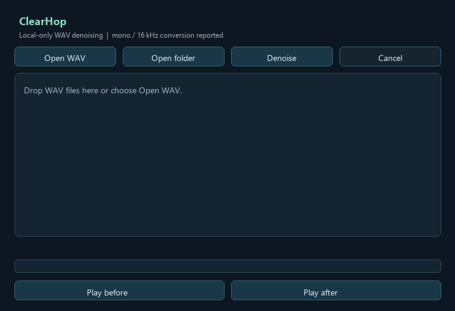
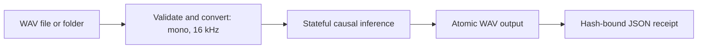

# ClearHop

Local causal speech denoising, built for reproducible research and real-time deployment.

ClearHop is a Windows-first desktop and Python pipeline for local-only WAV enhancement. Audio is never uploaded; there is no telemetry. The production signal contract is mono, 16 kHz, 20 ms frames, 10 ms hop, and 161 STFT bins.

## Install on Windows

After cloning, run one command:

```powershell
pwsh -ExecutionPolicy Bypass -File .\scripts\install-desktop.ps1 -Launch
```

Use `-Offline` for the checked CPU bundle or `-DryRun` to inspect the plan. Assets are activated only after SHA-256 verification. The installed command is `noise-reduce-desktop`.

## Desktop workflow

- Open or drag one WAV file, or select a folder for batch processing.
- Review explicit mono/16 kHz conversion status.
- Denoise without blocking the UI; cancel safely; isolate per-file errors.
- Play before/after audio and save atomic WAV output plus a JSON receipt.





The stable desktop contract lives in `desktop/pipeline.py`; reusable inference lives in the installed `src` package. Receipts bind input/output SHA-256, conversion, checkpoint SHA-256, elapsed time, and status.

## Reproduced production evidence

These results are local measurements, not external marketing claims.

| Check | Reproduced result | Public receipt |
|---|---:|---|
| CPU streaming p95, 5,000 hops | 3.96217 ms | [`reports/public/production_readiness_verify.json`](reports/public/production_readiness_verify.json) |
| CPU ONNX p95, 5,000 hops | 2.147705 ms | [`reports/public/production_readiness_verify.json`](reports/public/production_readiness_verify.json) |
| Soak | 7,200 s; 2,292,681 iterations; 0 failures | [`reports/public/production_readiness_verify.json`](reports/public/production_readiness_verify.json) |
| Production checkpoint | `1305037b59438b1679f6202762001f52f5fb5bd80d6a7ee0e184bc7af46e4789` | [`configs/desktop_assets.json`](configs/desktop_assets.json) |

## Research evidence

The five-seed protocol, manifests, selection checks, and robustness evidence are bound in [`reports/public/research_readiness.json`](reports/public/research_readiness.json). The model comparison schema and per-adapter status are in [`reports/public/model_comparison.json`](reports/public/model_comparison.json).

Against the frozen historical baseline: SNR delta `+8.0161 dB`, 95% CI `[7.6781, 8.3618]`; STOI delta `+0.01064`, 95% CI `[0.00927, 0.01202]`; SI-SDR delta `+0.02756 dB`, 95% CI `[-0.04418, 0.09995]`, not statistically significant.

DeepFilterNet3, RNNoise, DTLN, and WebRTC NS results remain `blocked` unless reproduced with exact source, weights, license, sample-rate conversion, command, and hardware metadata. Published numbers never substitute for local measurements. See [`docs/research-comparison.md`](docs/research-comparison.md) and [`MODEL_CARD.md`](MODEL_CARD.md).

## Verify and develop

```powershell
python -m pip install -e ".[desktop,dev,metrics,export]"
python -m pytest -q
python scripts/verify.py --production-readiness
python scripts/verify.py --research-readiness
python scripts/verify.py --publish-readiness
```

CI runs Linux tests plus a Windows offscreen open/process/save smoke. Tagged releases additionally gate on all verifiers, a clean wheel install, asset hashes, PyInstaller `onedir` launch outside the repository, ZIP inventory, and checksum creation.

## Project policy

- Apache-2.0 code license: [`LICENSE`](LICENSE)
- Citation metadata: [`CITATION.cff`](CITATION.cff)
- Private vulnerability reporting: [`SECURITY.md`](SECURITY.md)
- Contribution contract: [`CONTRIBUTING.md`](CONTRIBUTING.md)
- Release history: [`CHANGELOG.md`](CHANGELOG.md)

Datasets, personal audio, exploratory artifacts, historical checkpoints, and third-party weights are excluded from Git history.
